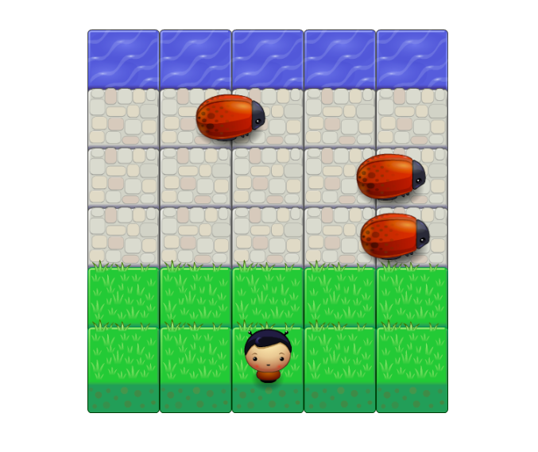

## Classic Arcade Game decription
This is arcade game allows player to move within field(left, right, up, down), once player reaches the water area without colliding with enemies (3 bugs), game is over and won!

## Challenge of game
Try to reach the water area by avoiding collision with enemies, which move on different speeds.

## Quickstart
* Clone  or download the following repo https://github.com/sveta0112/frontend-nanodegree-arcade-game
* Open the project folder.
* Locate the file 'index.html' and open it with preferred browser.

## Instructions for game
* Try to move player to left, right, up, down with arrow keys on keyboard.
* Your goal to reach water area using those arrow keys without 'hitting' bugs
* Once player collides with one of the enemies, game will start over
* Once player reaches water area, congratulation window will pop up, and game will start over.

